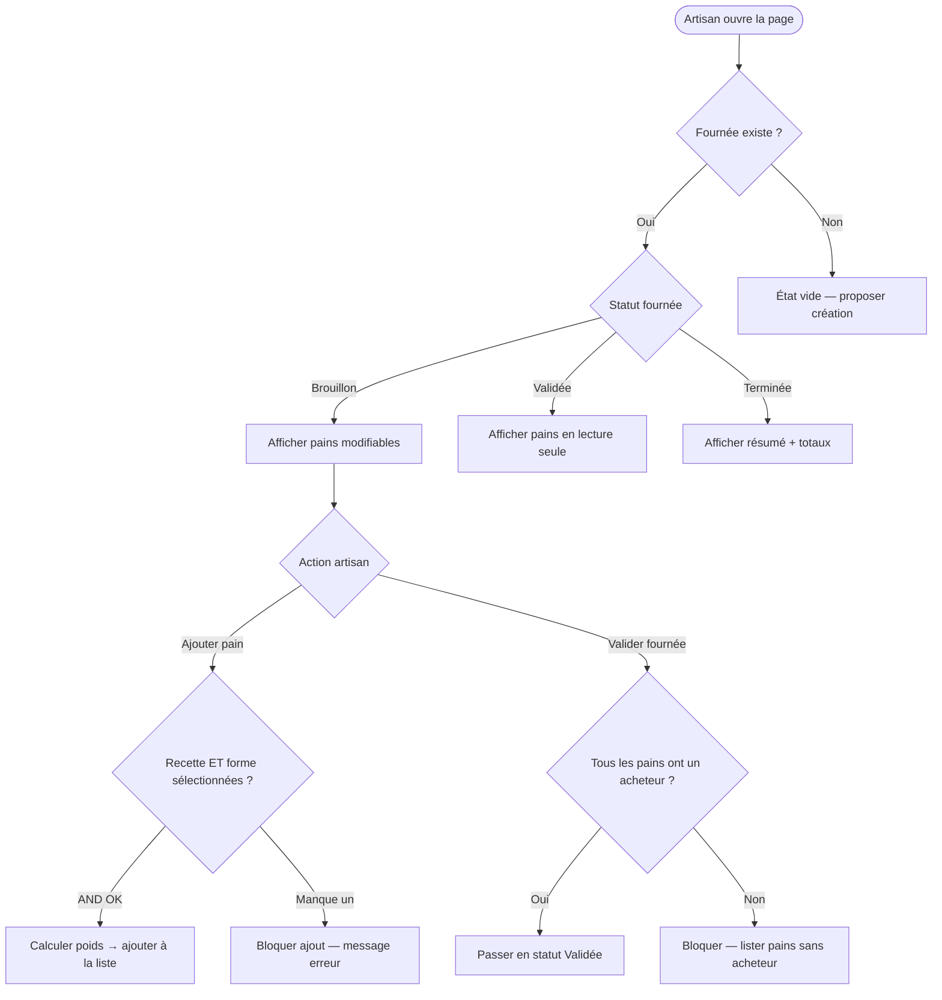

# Front Clarify: $ARGUMENTS

## Step 1: Understand the business context

Before anything, **learn the domain**. Search for existing domain code, entities, and business vocabulary:

```bash
grepai search "domain entities and business rules" --json --compact 2>/dev/null || grep -rn "class.*dataclass\|class.*Rules" src/domain/ --include="*.py" | head -20
```

```bash
ls specs/ 2>/dev/null
ls maquettes/ 2>/dev/null
```

```bash
grepai search "$ARGUMENTS" 2>/dev/null | head -10 || true
```

**Identify who the users are** (bakers, accountants, admins, artisans...) and **what vocabulary they use** (grams of flour, hydration rate, batch, order...). Speak their language, not developer language.

## Step 2: Conversation to clarify the use case

**Help the user formulate their need. Guide them to express WHAT the page does for the user, not HOW it's built.**

Start by showing you understand their world:
> D'après ce que je vois du domaine, {observation sur le métier}.
> Raconte-moi : quand {type d'utilisateur} arrive sur cette page, il veut faire quoi ?

Then help them develop their thinking — reformulate, relance, creuse :
- **"Et ensuite ?"** — pour dérouler le parcours naturel
- **"Qu'est-ce qu'il voit en premier ?"** — pour ancrer dans le concret
- **"Ça arrive que... ?"** — pour découvrir les cas limites naturellement
- **"Qui d'autre utilise cette page ?"** — pour les rôles/accès
- **"Et si c'est vide / si ça plante ?"** — pour les edge cases

**Use their domain vocabulary.** Adapt to whatever domain the project is about.

**Le but n'est PAS d'obtenir une spec technique. C'est de comprendre l'intention utilisateur.** L'utilisateur décrit son besoin, toi tu structures.

**Don't ask questions already answered.**

## Step 3: Generate scenario diagram and confirm

After the conversation, **generate a Mermaid flowchart** with logic gates that shows all scenarios. The diagram makes conditions, branching, and outcomes visually clear.

Use logic gate notation:
- **Conditions** as diamond decision nodes
- **AND** gates when multiple conditions must be true together
- **OR** gates when any condition triggers the path
- **Actions** as rounded boxes
- **States/Outcomes** as rectangles

Example:

````markdown

````

Present the diagram:
> Voici le diagramme des scénarios :
>
> {mermaid diagram}
>
> Il manque des branches ? Un cas qu'on n'a pas couvert ?

**Wait for explicit validation of the diagram.**

## Step 4: Write flow spec

```bash
mkdir -p specs/flows
```

Create `specs/flows/{page}.md`:

```markdown
# {Page} — Flux utilisateur

## Contexte métier
{Qui sont les utilisateurs, quel est leur vocabulaire, que font-ils au quotidien}

## Diagramme des scénarios

{Mermaid diagram validated by user}

## Données affichées
{Liste des données visibles par état, nommées avec le vocabulaire métier — ce qui va servir de base pour les maquettes et le contrat API}
```

## Step 5: Next step

> Flux écrit dans `specs/flows/{page}.md`
>
> Prochaine étape : `/clear` puis `/front-maquette {page}`
